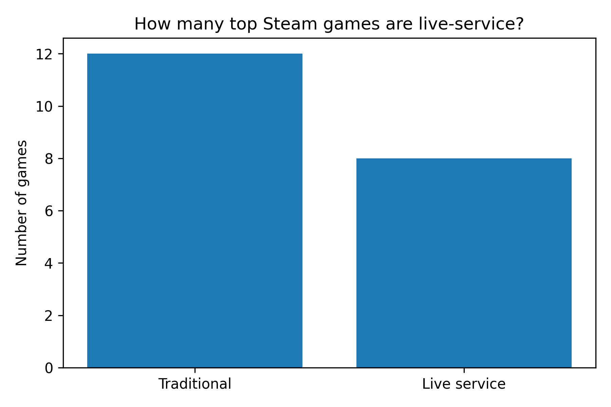
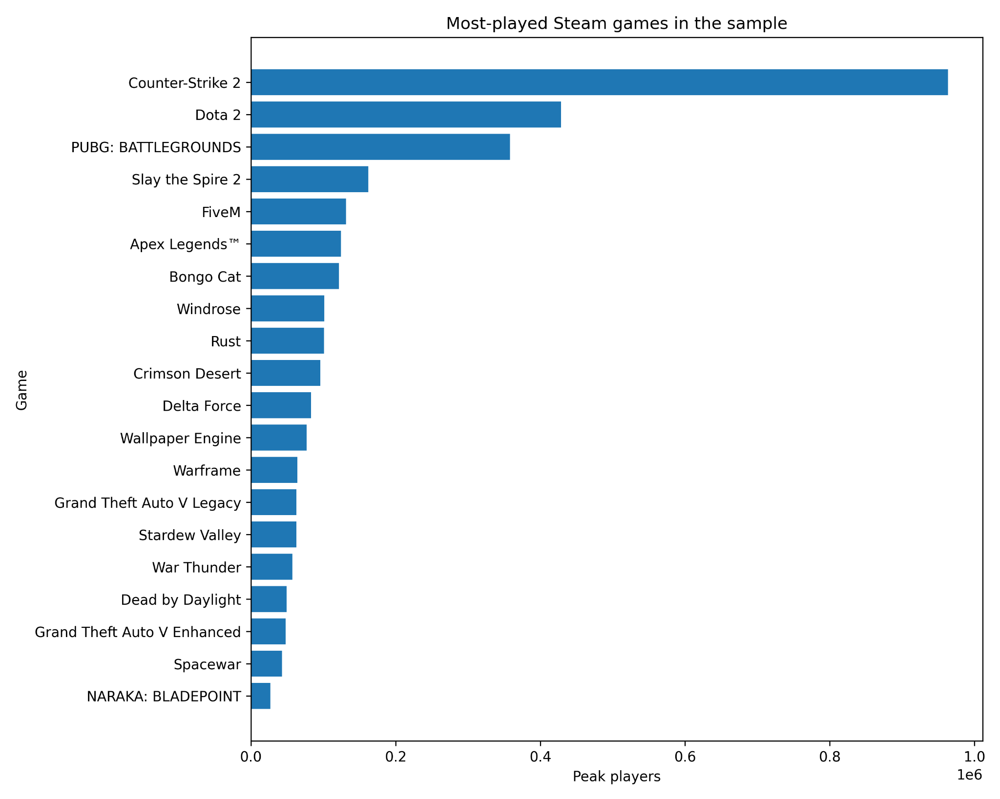
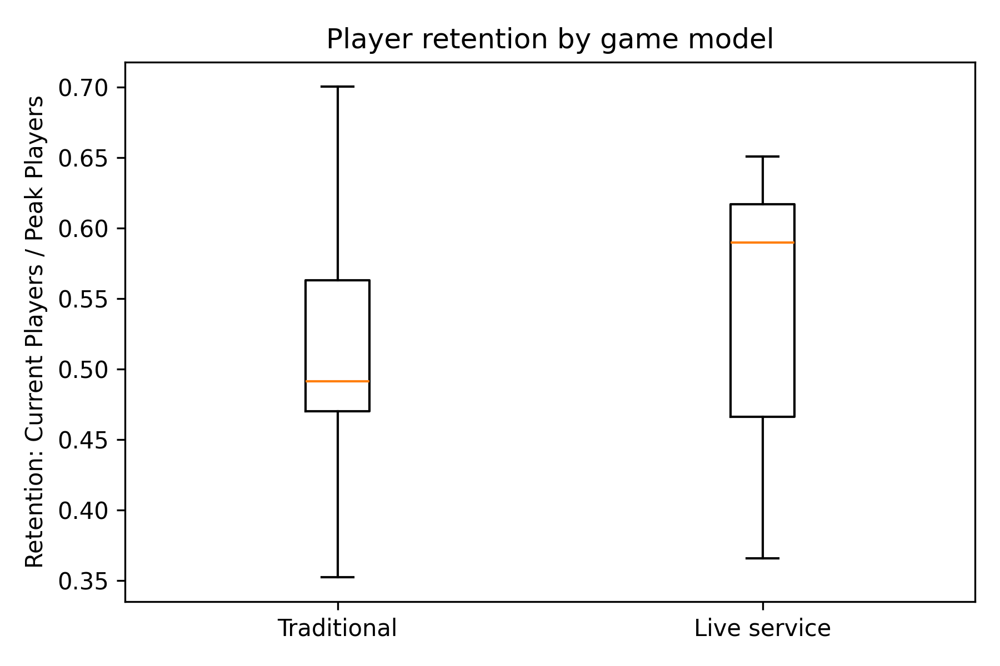

```{python}
import math
import pandas as pd

summary = pd.read_csv("data/summary_by_model.csv")
summary["mean_average_players"] = summary["mean_average_players"].round(0).astype(int)
summary["median_average_players"] = summary["median_average_players"].round(0).astype(int)
summary["mean_peak_players"] = summary["mean_peak_players"].round(0).astype(int)
summary["mean_retention"] = summary["mean_retention"].round(3)

live_effect_pct = (math.exp(1.0000) - 1) * 100
```

::: {.hero}
Games are no longer just products that players buy once and complete. Many of the largest titles now operate as platforms: constantly updated, socially embedded, and designed to keep players returning. This post asks whether that model actually produces stronger player engagement.
:::

::: {.callout-note appearance="simple" icon=false}
## Research question
**Do live-service games achieve higher and more persistent player engagement than traditional games?**
:::

## Why live-service games matter

The video game industry has changed dramatically over the last two decades. What was once an industry built mainly around one-time purchases has increasingly shifted toward games designed as ongoing services. Today, many major titles use seasonal updates, online multiplayer ecosystems, battle passes, cosmetic stores, subscription services, and regular live events. In this model, games are not just products; they are platforms intended to keep players engaged continuously by manipulating them through FOMO (*Fear of missing out*).

Player attention has therefore become one of the gaming industry's most valuable resources. A traditional game may sell millions of copies during launch week, but many players eventually move on once they finish the content. By contrast, live-service games are explicitly designed to encourage long-term engagement through progression systems, social interaction, limited-time events, and constant updates.

I am to compare live-service and traditional games using Steam player data. The analysis combines descriptive statistics with simple regression modelling to evaluate whether live-service games systematically differ from traditional games in terms of player engagement and retention.

## From one-time products to ongoing platforms

Early video games in the 1980s and 1990s were constrained by hardware and distribution. Most titles were sold physically on cartridges or discs and were designed as complete experiences from release. Once players purchased a game, they owned the entire product. Multiplayer usually meant local play: friends sharing the same console or computer.

Widespread internet access changed this model. Developers could update games after release, host online servers, and maintain persistent worlds. This created the foundation for the live-service model. Games such as *RuneScape (2001)* and *World of Warcraft (2004)* showed that players were willing to pay continuously for games that continuously evolved.

That economic logic is central to the modern gaming industry. Traditional games rely heavily on launch sales. Live-service games generate ongoing revenue through subscriptions, cosmetic purchases, expansions, battle passes, and microtransactions. As a result, modern game design increasingly prioritises retention and engagement rather than only initial sales.

## Data and classification

The dataset combines publicly available Steam player information with SteamCharts-style ranking data. The main variables are current active players, peak player counts, historical Steam activity, and game metadata. Each game was manually classified as either a live-service game or a traditional game.

A game is classified as **live-service** if it contains features such as ongoing seasonal updates, battle passes, persistent online progression, frequent live events, or a long-term multiplayer ecosystem. A game is classified as **traditional** if it is mainly structured around a one-time purchase or a relatively self-contained gameplay experience.

```{python}
from IPython.display import Markdown

display(Markdown(summary.to_markdown(index=False)))
```

## Evidence 1: Live-service games are a minority of the sample

Within the top 20 most-played Steam games in the sample, only 8 titles are classified as live-service games, while 12 are classified as traditional games.

{fig-align="center" width="80%"}

This matters because the live-service model is often discussed as if it dominates the whole market. In this sample, live-service games are not the majority by count. Their importance comes from their concentration of player activity.

## Evidence 2: Player activity is highly concentrated

{fig-align="center" width="95%"}

The distribution of player activity is extremely uneven. *Counter-Strike 2* dominates the sample, with *Dota 2* and *PUBG: Battlegrounds* also far ahead of most other games. This suggests a “winner-takes-most” structure: the live-service model can produce enormous success, but that success is concentrated among a small number of dominant titles.

The descriptive statistics support this pattern. Live-service games have a much higher mean current player count than traditional games. The mean for live-service games is about 281,740 players, compared with about 75,715 for traditional games. Median player counts also favour live-service games, though the gap is smaller, which shows that a few extremely successful games pull the live-service average upward.

## Evidence 3: Retention is higher, but less clearly so

Player count alone does not fully capture engagement. A game may attract a large audience initially but fail to retain it. To estimate retention, I use the following ratio:

$$
\text{Retention} = \frac{\text{Current players}}{\text{Peak players}}
$$

{fig-align="center" width="82%"}

The boxplot suggests that live-service games have somewhat higher retention. The mean retention ratio is 0.541 for live-service games and 0.507 for traditional games. One major reason is the use of recurring engagement systems such as: seasonal updates, collaboration events, cosmetic rewards, strong player feedback taken, social multiplayer ecosystems all built on strong community feedback. 

A strong example is Fortnite’s “Astronomical” Travis Scott event in April 2020, which attracted over 27 million unique players across its limited-time concerts. 

<blockquote class="twitter-tweet"><p lang="en" dir="ltr">Thank you to everyone who attended and created content around the Travis Scott event! <br><br>Over 27.7 million unique players in-game participated live 45.8 million times across the five events to create a truly Astronomical experience. 🤯🔥 <a href="https://t.co/LSH0pLmGOS">pic.twitter.com/LSH0pLmGOS</a></p>&mdash; Fortnite (@Fortnite) <a href="https://twitter.com/Fortnite/status/1254817584676929537?ref_src=twsrc%5Etfw">April 27, 2020</a></blockquote> <script async src="https://platform.twitter.com/widgets.js" charset="utf-8"></script>

However, the distributions overlap substantially. This means the descriptive difference is suggestive, but not decisive.

## Regression analysis

To move beyond descriptive comparisons, I estimate two simple OLS regression models. The first examines whether live-service games are associated with larger active player bases:

$$
\log(\text{Current players}_i) = \alpha + \beta\text{LiveService}_i + \varepsilon_i
$$

The second examines whether live-service games are associated with higher retention:

$$
\text{Retention}_i = \alpha + \beta\text{LiveService}_i + \varepsilon_i
$$

| Model | Dependent variable | Live-service coefficient | p-value | R-squared | Interpretation |
|---|---:|---:|---:|---:|---|
| Model 1 | log current players | 1.000 | 0.006 | 0.348 | Live-service games have much larger active player bases. |
| Model 2 | retention | 0.034 | 0.455 | 0.031 | Live-service games have slightly higher retention, but the result is not statistically significant. |

Because Model 1 uses a logged dependent variable, the live-service coefficient can be interpreted approximately as a percentage difference. A coefficient of 1.000 implies that live-service games have about **172%** higher current player counts on average than traditional games. This is statistically significant at conventional levels.

Model 2 tells a different story. The live-service coefficient is positive, but small and statistically insignificant. This means the data does not provide strong evidence that live-service status alone explains better retention.

## Interpretation: Scale matters more than retention

The central finding is that live-service games appear much stronger on **scale** than on **retention**. They clearly attract and maintain larger active player communities. However, the evidence that they retain a higher proportion of their peak player base is weaker.

This distinction is important. It suggests that live-service success may rely less on a universally superior retention rate and more on network effects, social interaction, continuous content pipelines, and large existing communities. Once a live-service game becomes large, its size becomes part of its appeal: players join because other players are already there.

Traditional games operate differently. Their success is often based on delivering a complete, high-quality experience rather than maintaining constant engagement indefinitely. This does not make them inferior. It means they compete with a different strategy and player base in mind.

## Some limitations to consider

There are several limitations to this analysis. First, the classification of live-service games was manually coded, so some borderline cases may be debatable. Second, the regressions should not be interpreted causally. Live-service status is not randomly assigned, and highly popular games may be more likely to adopt live-service mechanics because they already have large audiences. Third, Steam data does not capture the whole gaming market, especially console and mobile gaming. Finally, current players and peak players are imperfect measures of engagement because they cannot fully capture player satisfaction, loyalty, or monetisation.

## Conclusion

The gaming industry has increasingly shifted toward live-service models because they create opportunities for continuous engagement and recurring revenue. This analysis finds strong evidence that live-service games maintain significantly larger active player bases than traditional games. However, the evidence that they retain players substantially better is weaker than expected.

The modern gaming dilemma is therefore not simply whether live-service games are more successful. It is whether the industry's growing focus on continuous engagement changes what games are designed to be: complete experiences, or persistent platforms competing for player attention.

## Appendix: regression output

```{python}
from pathlib import Path
print(Path("appendix/regression_results.txt").read_text())
```
